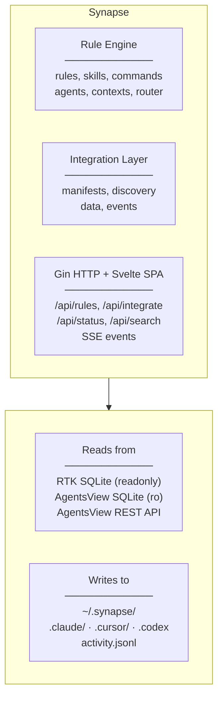

# Synapse

> The psychic link between AI coding tools.

A Go CLI + embedded Svelte web UI that manages rules/skills for AI coding assistants and connects independent tools (RTK, AgentsView, and others) into a unified workflow.

**Implemented in Go**, with an integration layer for third-party tool orchestration.

---

## Reference Sources

These local repositories serve as reference implementations throughout this plan:

| Source | Path | Purpose |
|--------|------|---------|
| **AgentsView** | `~/opensource/agentsview` | Go + embedded Svelte reference — build pipeline, `go:embed` pattern, middleware, SQLite schema |
| **RTK** | `~/opensource/rtk` | Rust CLI with SQLite tracking — database schema for token savings integration |

---

## Why golang?

- **Single binary deployment** — no Node.js runtime required. Same pattern as AgentsView and RTK.
- **Native SQLite** — `modernc.org/sqlite` (pure Go, no CGO) for reading RTK and AgentsView databases.
- **Embedded frontend** — `go:embed` compiles the Svelte SPA into the binary (same approach as AgentsView).
- **Cross-platform** — Go's cross-compilation produces binaries for Linux/macOS/Windows from one build.
- **Ecosystem alignment** — AgentsView is Go, RTK is Rust. Go is the natural choice for a tool that bridges them.

---

## Architecture



---

## Project Structure

```
synapse/
├── cmd/synapse/
│   └── main.go                    # CLI entry point (cobra)
│
├── internal/
│   ├── config/
│   │   └── config.go              # Layered config: defaults → YAML → env → flags
│   │
│   ├── rules/
│   │   ├── engine.go              # Rule/skill loading, frontmatter parsing
│   │   ├── scanner.go             # Recursive .md file discovery + metadata extraction
│   │   ├── router.go              # Semantic router: LiteLLM-based + keyword fallback
│   │   ├── router_test.go         # Router unit tests (keyword + mock LLM)
│   │   ├── installer.go           # Copy/sync rules to .claude/, .cursor/, .codex/
│   │   ├── installer_test.go      # Installer tests (temp dirs, hash verification)
│   │   ├── registry.go            # Community registry client (GitHub API)
│   │   ├── registry_test.go       # Registry tests (HTTP mocks)
│   │   └── types.go               # Rule, Skill, Category, FileInfo types
│   │
│   ├── integration/
│   │   ├── manifest.go            # YAML manifest loading from 3 paths
│   │   ├── manifest_test.go       # Manifest parsing tests
│   │   ├── discovery.go           # Binary/file/HTTP detection of installed tools
│   │   ├── discovery_test.go      # Discovery tests (mock filesystem + HTTP)
│   │   ├── data.go                # Read-only SQLite + HTTP adapters
│   │   ├── data_test.go           # Data adapter tests (in-memory SQLite)
│   │   ├── events.go              # Fire-and-forget event dispatch
│   │   ├── events_test.go         # Event dispatch tests
│   │   ├── activity.go            # JSONL activity log writer
│   │   ├── activity_test.go       # Activity log tests
│   │   └── types.go               # ToolManifest, ToolStatus, DataEndpoint types
│   │
│   ├── server/
│   │   ├── server.go              # Gin HTTP server with REST API + SPA serving
│   │   ├── server_test.go         # Server integration tests
│   │   ├── rules_api.go           # /api/rules, /api/registry, /api/install, /api/remove
│   │   ├── rules_api_test.go      # Rules API tests
│   │   ├── integration_api.go     # /api/integrations, /api/integrations/:id/data
│   │   ├── integration_api_test.go
│   │   ├── status_api.go          # /api/status, /api/doctor
│   │   ├── status_api_test.go
│   │   ├── middleware.go          # CORS, auth, CSP, host-check, logging, rate-limit
│   │   └── middleware_test.go     # Middleware unit tests
│   │
│   ├── deploy/
│   │   ├── claude.go              # Deploy to .claude/ (rules, hooks, settings.json)
│   │   ├── cursor.go              # Deploy to .cursor/rules/ (.md → .mdc conversion)
│   │   ├── codex.go               # Deploy to .codex/ (aggregate → AGENTS.md)
│   │   ├── deploy.go              # Common deploy interface
│   │   └── deploy_test.go         # Deploy tests for all targets
│   │
│   ├── llm/
│   │   ├── client.go              # LiteLLM proxy / direct API client
│   │   ├── client_test.go         # LLM client tests (HTTP mocks)
│   │   └── types.go               # Request/response types (OpenAI-compatible)
│   │
│   ├── errors/
│   │   ├── errors.go              # Typed errors, retry logic, circuit breaker
│   │   └── errors_test.go         # Error handling tests
│   │
│   ├── db/
│   │   ├── db.go                  # SQLite for synapse's own metadata
│   │   └── db_test.go             # Database tests
│   │
│   └── web/
│       └── embed.go               # //go:embed all:dist
│
├── config/
│   ├── rules/                     # Bundled rule library
│   ├── skills/                    # Bundled skills
│   ├── commands/                  # Bundled commands
│   ├── agents/                    # Bundled agents
│   ├── contexts/                  # Bundled contexts
│   ├── integrations/
│   │   └── integrations.yaml      # Built-in manifests for RTK + AgentsView
│   └── templates/                 # Project templates (basic, node-express, react-nextjs)
│
├── frontend/                      # Svelte 5 SPA
│   ├── package.json
│   ├── vite.config.ts
│   ├── src/
│   │   ├── App.svelte
│   │   ├── lib/
│   │   │   ├── api/               # API client for Go backend
│   │   │   ├── stores/            # Svelte 5 reactive stores
│   │   │   ├── components/
│   │   │   │   ├── rules/         # Rule browser, installer, search
│   │   │   │   ├── integrations/  # Tool cards, status, data previews
│   │   │   │   ├── diagnostics/   # Doctor checks, health status
│   │   │   │   └── layout/        # Header, sidebar, tabs
│   │   │   └── utils/
│   │   └── app.css
│   └── tsconfig.json
│
├── tests/
│   ├── e2e_test.go                # End-to-end CLI tests
│   └── testutil/
│       ├── fixtures.go            # Shared test fixtures
│       ├── mockhttp.go            # HTTP mock helpers
│       └── mockfs.go              # Filesystem mock helpers
│
├── scripts/
│   ├── install.sh                 # curl-pipe installer
│   └── build.sh                   # Build Go + frontend
│
├── go.mod
├── go.sum
├── Makefile
├── CLAUDE.md                      # Instructions for Claude Code working on this repo
├── PLAN.md                        # This file
├── README.md
└── LICENSE
```

---

## CLI command map

### Core rule management

| Synapse command | Implementation |
|-----------------|----------------|
| `synapse init` | `internal/rules/installer.go` |
| `synapse init -i` | Interactive wizard via charmbracelet/huh |
| `synapse update` | `internal/rules/installer.go` |
| `synapse list` | `internal/rules/scanner.go` |
| `synapse add <url>` | `internal/rules/registry.go` + git clone |
| `synapse remove <source>` | Remove source + cleanup |
| `synapse search <keyword>` | `internal/rules/registry.go` |
| `synapse test <prompt>` | `internal/rules/router.go` |
| `synapse doctor` | `cmd/synapse/` + integration checks |
| `synapse browse` | `internal/server/` + embedded Svelte |
| `synapse get <file>` | Download single rule from registry |
| `synapse uninstall` | Remove all synapse-managed files |

### Semantic router (Go)

Earlier stacks often combined a **Node-based Claude Code hook** with a separate router implementation. That split adds a Node runtime on the hot path. Synapse implements routing in Go end-to-end:

#### What the legacy CJS hook did (behavior Synapse replaces)

1. Receives prompt from stdin (Claude Code passes `{ "prompts": [{"content": "..."}] }`)
2. Scans `~/.claude/rules/` and `~/.claude/rules-inactive/` for `.md` files
3. Parses YAML frontmatter from each file to extract `description` and `keywords`
4. **Tier 1 (AI-based):** Calls Claude Haiku or GPT-4o-mini API with the prompt + file metadata, asks the model to return a JSON array of relevant filenames
5. **Tier 2 (Keyword fallback):** If AI call fails or is disabled, matches prompt words against an 80+ keyword map (English + Korean) and frontmatter keywords
6. Always keeps `essential.md` and `security.md` active
7. Moves selected files to `~/.claude/rules/` (active) and unselected to `~/.claude/rules-inactive/` (hidden)

#### How Synapse Replaces It

Synapse provides **two complementary mechanisms**:

**A) Native Go hook binary (`synapse hook`)**

A new subcommand that acts as a drop-in replacement for the CJS hook:

```json
{
  "hooks": {
    "UserPromptSubmit": [{
      "hooks": [{"type": "command", "command": "synapse hook"}],
      "timeout": 120
    }]
  }
}
```

The `synapse hook` command:
- Reads stdin JSON (same format Claude Code provides)
- Uses the same Go router logic as `synapse test`
- Moves files between active/inactive directories (same behavior as CJS hook)
- Is a compiled binary — no Node.js required
- Falls back gracefully if LLM is unreachable (keyword-only mode)

**B) `synapse test <prompt>` CLI command**

Uses the same router logic for interactive testing without modifying files.

#### Keyword map

The router maintains 80+ keyword-to-file mappings, including Korean language support, in a Go map:

```go
// internal/rules/router.go
var keywordMap = map[string][]string{
    "react":      {"react.md", "frontend.md"},
    "typescript": {"typescript.md", "frontend.md"},
    "test":       {"testing.md"},
    "security":   {"security.md"},
    "docker":     {"docker.md", "devops.md"},
    "database":   {"database.md"},
    // ... 80+ entries including Korean keywords
    "리액트":     {"react.md", "frontend.md"},
    "테스트":     {"testing.md"},
}
```

#### Tier 3 (New): Integration Signals

Synapse adds a third routing tier: querying RTK's command history for project-specific signals:
- Project has heavy `cargo test` → load `rust.md` + `testing.md`
- Project has heavy `docker-compose` → load `docker.md`
- Project has no test commands → deprioritize `testing.md`

### Multi-Tool Deployment

| Target | Format | Implementation |
|--------|--------|----------------|
| Claude Code | `.md` in `.claude/` | `internal/deploy/claude.go` |
| Cursor | `.mdc` in `.cursor/rules/` | `internal/deploy/cursor.go` (frontmatter conversion) |
| Codex | Aggregated `AGENTS.md` in `.codex/` | `internal/deploy/codex.go` |

### Metadata & Change Detection

- `~/.synapse/meta.json` — installation metadata, sources, file hashes, timestamps
- MD5 hashing for user-edit detection
- Non-destructive updates: never overwrite user-modified files without confirmation

---

## LLM Integration via LiteLLM Docker

### Safety-Critical: LiteLLM Supply Chain Compromise

**On March 24, 2026, LiteLLM PyPI versions 1.82.7 and 1.82.8 were compromised** via a supply chain attack (threat actor TeamPCP). The malware stole SSH keys, environment variables, cloud credentials, and crypto wallets.

**However, the official LiteLLM Proxy Docker image was NOT affected.** The Docker deployment path pins dependencies in `requirements.txt` and does not pull from the compromised PyPI packages. This is confirmed in LiteLLM's official security advisory.

References:
- [LiteLLM Security Advisory](https://docs.litellm.ai/blog/security-update-march-2026)
- [Sonatype Analysis](https://www.sonatype.com/blog/compromised-litellm-pypi-package-delivers-multi-stage-credential-stealer)
- [Snyk Technical Breakdown](https://snyk.io/articles/poisoned-security-scanner-backdooring-litellm/)

**Synapse's LiteLLM strategy: Docker only.**

1. **Docker image only.** Synapse documents and recommends the official LiteLLM Docker image (`ghcr.io/berriai/litellm`) as the deployment method. Never `pip install litellm`.
2. **No Python dependency.** Synapse is a pure Go binary. It talks to LiteLLM proxy over HTTP — the proxy runs in a separate Docker container.
3. **Go-native fallback.** Synapse can call model APIs directly via `net/http` without any LiteLLM dependency — the LiteLLM proxy is optional but recommended for multi-model setups.
4. **`synapse doctor` checks.** The doctor command validates that any running LiteLLM proxy is the Docker version, and warns if it detects a pip-installed version.

### LiteLLM Docker Setup

Synapse includes a documented Docker Compose configuration for the LiteLLM proxy:

```yaml
# docker-compose.litellm.yaml (provided as reference, not required)
services:
  litellm:
    image: ghcr.io/berriai/litellm:main-latest
    ports:
      - "4000:4000"
    volumes:
      - ./litellm-config.yaml:/app/config.yaml
    command: ["--config", "/app/config.yaml"]
    environment:
      - ANTHROPIC_API_KEY=${ANTHROPIC_API_KEY}
      - OPENAI_API_KEY=${OPENAI_API_KEY}
```

```yaml
# litellm-config.yaml (example)
model_list:
  - model_name: claude-3-haiku
    litellm_params:
      model: claude-3-haiku-20240307
      api_key: os.environ/ANTHROPIC_API_KEY
  - model_name: gpt-4o-mini
    litellm_params:
      model: gpt-4o-mini
      api_key: os.environ/OPENAI_API_KEY
```

### LLM Client Architecture (`internal/llm/`)

The semantic router needs to call an LLM for Tier 1 routing. Synapse supports three backends, configured via `~/.synapse/config.yaml`:

```yaml
llm:
  # Option 1: LiteLLM Docker proxy (recommended for multi-model setups)
  # Run: docker compose -f docker-compose.litellm.yaml up -d
  # The official Docker image was NOT affected by the supply chain attack.
  # NEVER use pip install. Docker only.
  # See: https://docs.litellm.ai/blog/security-update-march-2026
  provider: litellm
  base_url: "http://localhost:4000"
  model: "claude-3-haiku"

  # Option 2: Direct Anthropic API (no proxy needed)
  # provider: anthropic
  # api_key_env: ANTHROPIC_API_KEY   # reads from this env var
  # model: "claude-3-haiku-20240307"

  # Option 3: Direct OpenAI API
  # provider: openai
  # api_key_env: OPENAI_API_KEY
  # model: "gpt-4o-mini"

  timeout: 10s
  max_retries: 2
```

The `internal/llm/client.go` implementation:

```go
// Client provides a unified interface for LLM calls.
// All providers use OpenAI-compatible HTTP endpoints.
type Client struct {
    BaseURL    string
    APIKey     string
    Model      string
    HTTPClient *http.Client
    Timeout    time.Duration
    MaxRetries int
}

// Complete sends a chat completion request. Returns the model's text response.
// Uses OpenAI-compatible /v1/chat/completions endpoint for all providers
// (Anthropic API uses /v1/messages with slight format differences).
func (c *Client) Complete(ctx context.Context, messages []Message) (string, error)
```

This is a thin HTTP client — no SDK dependencies. LiteLLM Docker proxy and OpenAI both expose `/v1/chat/completions`. For direct Anthropic, we use `/v1/messages` with the Anthropic header format.

---

## Error Handling & Resilience

### Design Principles

External resources (RTK database, AgentsView API, GitHub registry, LLM APIs) are **unreliable by nature**. Synapse must never crash or block due to an external failure.

### Typed Error Categories (`internal/errors/`)

```go
type ExternalError struct {
    Source  string        // "rtk", "agentsview", "github", "llm"
    Op      string        // "query", "connect", "fetch"
    Err     error         // underlying error
    Timeout bool          // was this a timeout?
}

func (e *ExternalError) Error() string
func (e *ExternalError) Unwrap() error
func IsTimeout(err error) bool
func IsLocked(err error) bool
```

### Per-Resource Strategies

| Resource | Failure Mode | Strategy |
|----------|-------------|----------|
| **RTK SQLite** | DB locked (another process writing) | Retry once after 500ms with `PRAGMA busy_timeout=3000`. If still locked, return cached/empty `TokenSavingsReport` with `DataStale: true` flag. Never write to RTK's DB. |
| **RTK SQLite** | File missing | Return `ToolStatus{Installed: false, DataFilesMissing: ["tracking.db"]}`. Not an error — RTK may not be installed. |
| **AgentsView SQLite** | DB locked | Same retry + busy_timeout strategy as RTK. Return stale data on failure. |
| **AgentsView REST API** | Connection refused / timeout | 3s timeout. Return `APIReachable: ptr(false)` in `ToolStatus`. UI shows "API offline" badge. |
| **AgentsView REST API** | HTTP 4xx/5xx | Log warning, return error to caller. UI shows specific error. |
| **GitHub Registry** | Unreachable / rate-limited | 5s timeout. Cache last-known registry index in `~/.synapse/cache/registry.json` (TTL: 1 hour). Serve from cache on failure. Show "offline — showing cached results" in UI. |
| **GitHub Registry** | 403 rate limit | Parse `X-RateLimit-Reset` header, display "rate limited, retry after {time}" to user. |
| **LLM API (Tier 1 routing)** | Timeout / error / unreachable | Fall back to Tier 2 keyword routing silently. Log the failure. Semantic router must never block on LLM failure. 10s timeout. |
| **LLM API** | Invalid response (no JSON) | Parse failure → fall back to keyword routing. Log malformed response for debugging. |

### Circuit Breaker for Repeated Failures

For LLM and HTTP endpoints, implement a simple circuit breaker:

```go
type CircuitBreaker struct {
    mu           sync.Mutex
    failures     int
    threshold    int           // e.g., 3 consecutive failures
    resetAfter   time.Duration // e.g., 60 seconds
    lastFailure  time.Time
    state        State         // closed, open, half-open
}

func (cb *CircuitBreaker) Allow() bool
func (cb *CircuitBreaker) RecordSuccess()
func (cb *CircuitBreaker) RecordFailure()
```

When the circuit opens (3 consecutive failures), skip the external call entirely for 60 seconds. This prevents slow cascading failures when a service is down.

### SQLite Connection Best Practices

```go
// Open RTK/AgentsView databases read-only with safety pragmas
func OpenReadOnly(path string) (*sql.DB, error) {
    db, err := sql.Open("sqlite", path+"?mode=ro&_busy_timeout=3000")
    if err != nil {
        return nil, &ExternalError{Source: source, Op: "open", Err: err}
    }
    db.SetMaxOpenConns(1)          // single reader, avoid contention
    db.SetConnMaxLifetime(5 * time.Minute)
    return db, nil
}
```

---

## HTTP Server: Gin + Security Best Practices

### Why Gin

AgentsView uses stdlib `net/http` with custom middleware. Synapse uses **Gin** for:
- Built-in route grouping and parameter binding
- Middleware chaining with `c.Next()` / `c.Abort()`
- Structured error handling via `c.AbortWithStatusJSON`
- Request validation with struct tags
- Performance (radix tree router)

### Server Implementation (`internal/server/`)

```go
type Server struct {
    engine      *gin.Engine
    cfg         config.Config
    ruleEngine  *rules.Engine
    integrations *integration.Manager
    db          *db.Store
    spaFS       fs.FS
}

func New(cfg config.Config, ...) *Server {
    if cfg.Production {
        gin.SetMode(gin.ReleaseMode)
    }
    r := gin.New() // don't use Default() — we set up our own middleware
    s := &Server{engine: r, ...}
    s.setupMiddleware()
    s.setupRoutes()
    return s
}
```

### Middleware Stack

Applied in order (outermost first):

```go
func (s *Server) setupMiddleware() {
    // 1. Recovery — catch panics, return 500
    s.engine.Use(gin.Recovery())

    // 2. Request ID — add X-Request-ID for tracing
    s.engine.Use(requestIDMiddleware())

    // 3. Structured logging — log method, path, status, latency
    s.engine.Use(structuredLogMiddleware())

    // 4. Security headers — CSP, X-Frame-Options, X-Content-Type-Options
    s.engine.Use(securityHeadersMiddleware(s.cfg))

    // 5. CORS — restrict origins based on config
    s.engine.Use(corsMiddleware(s.cfg))

    // 6. Host check — prevent DNS rebinding attacks
    s.engine.Use(hostCheckMiddleware(s.cfg))

    // 7. Rate limiting — per-IP token bucket (10 req/s burst, 5 req/s sustained)
    s.engine.Use(rateLimitMiddleware())
}
```

### Security Implementation Details

**Localhost-only by default:**
```go
// Default: bind to 127.0.0.1 only. Requires explicit flag for remote access.
cfg.Host = "127.0.0.1"  // NOT 0.0.0.0
```

**Bearer token auth for remote access** (following AgentsView's pattern):
```go
func authMiddleware(cfg config.Config) gin.HandlerFunc {
    return func(c *gin.Context) {
        // Localhost connections bypass auth
        if isLocalhost(c.Request) {
            c.Next()
            return
        }
        // Remote connections require bearer token
        token := extractBearerToken(c.Request)
        if token == "" || !secureCompare(token, cfg.AuthToken) {
            c.AbortWithStatusJSON(401, gin.H{"error": "unauthorized"})
            return
        }
        c.Next()
    }
}
```

**CORS + CSRF protection:**
```go
func corsMiddleware(cfg config.Config) gin.HandlerFunc {
    return func(c *gin.Context) {
        origin := c.GetHeader("Origin")
        if origin == "" {
            // No origin = same-origin or non-browser. Allow GET/HEAD, block mutations.
            if isMutating(c.Request.Method) {
                c.AbortWithStatusJSON(403, gin.H{"error": "missing origin header"})
                return
            }
            c.Next()
            return
        }
        if !isAllowedOrigin(origin, cfg) {
            c.AbortWithStatusJSON(403, gin.H{"error": "origin not allowed"})
            return
        }
        c.Header("Access-Control-Allow-Origin", origin)
        c.Header("Access-Control-Allow-Methods", "GET, POST, PUT, DELETE, OPTIONS")
        c.Header("Access-Control-Allow-Headers", "Authorization, Content-Type")
        c.Header("Access-Control-Max-Age", "86400")
        if c.Request.Method == "OPTIONS" {
            c.AbortWithStatus(204)
            return
        }
        c.Next()
    }
}
```

**Content Security Policy:**
```go
func securityHeadersMiddleware(cfg config.Config) gin.HandlerFunc {
    return func(c *gin.Context) {
        if !strings.HasPrefix(c.Request.URL.Path, "/api/") {
            selfOrigin := fmt.Sprintf("http://%s:%d", cfg.Host, cfg.Port)
            c.Header("Content-Security-Policy",
                fmt.Sprintf("default-src 'self' %s; script-src 'self'; style-src 'self' 'unsafe-inline'", selfOrigin))
            c.Header("X-Frame-Options", "DENY")
        }
        c.Header("X-Content-Type-Options", "nosniff")
        c.Header("Referrer-Policy", "same-origin")
        c.Next()
    }
}
```

**Graceful shutdown:**
```go
func (s *Server) ListenAndServe(ctx context.Context) error {
    srv := &http.Server{
        Addr:         fmt.Sprintf("%s:%d", s.cfg.Host, s.cfg.Port),
        Handler:      s.engine,
        ReadTimeout:  10 * time.Second,
        WriteTimeout: 30 * time.Second,
        IdleTimeout:  120 * time.Second,
    }

    go func() {
        <-ctx.Done()
        shutdownCtx, cancel := context.WithTimeout(context.Background(), 5*time.Second)
        defer cancel()
        srv.Shutdown(shutdownCtx)
    }()

    return srv.ListenAndServe()
}
```

### Route Definitions

```go
func (s *Server) setupRoutes() {
    api := s.engine.Group("/api")
    {
        api.GET("/status", s.handleStatus)
        api.GET("/doctor", s.handleDoctor)

        rules := api.Group("/rules")
        {
            rules.GET("", s.handleListRules)
            rules.POST("", s.handleInstallRule)
            rules.DELETE("/:path", s.handleRemoveRule)
        }

        registry := api.Group("/registry")
        {
            registry.GET("", s.handleSearchRegistry)  // ?q=keyword
        }

        integrations := api.Group("/integrations")
        {
            integrations.GET("", s.handleListIntegrations)
            integrations.GET("/:id", s.handleGetIntegration)
            integrations.GET("/:id/data", s.handleGetIntegrationData)
        }

        api.POST("/test", s.handleTestRouter)
    }

    // SPA fallback — serve embedded frontend for all non-API routes
    s.engine.NoRoute(s.handleSPA)
}
```

---

## Frontend Build Pipeline

Following the **AgentsView pattern** exactly (see `~/opensource/agentsview/Makefile`):

### Makefile

```makefile
VERSION := $(shell git describe --tags --always --dirty 2>/dev/null || echo "dev")
COMMIT  := $(shell git rev-parse --short HEAD 2>/dev/null || echo "unknown")
BUILD_DATE := $(shell date -u +"%Y-%m-%dT%H:%M:%SZ")

LDFLAGS := -X main.version=$(VERSION) \
           -X main.commit=$(COMMIT) \
           -X main.buildDate=$(BUILD_DATE)
LDFLAGS_RELEASE := $(LDFLAGS) -s -w

# Ensure go:embed has content even before first frontend build
ensure-embed-dir:
	@mkdir -p internal/web/dist
	@test -f internal/web/dist/stub.html || echo '<!doctype html><title>build required</title>' > internal/web/dist/stub.html

# Build frontend and copy to embed directory
frontend:
	cd frontend && npm install && npm run build
	rm -rf internal/web/dist
	cp -r frontend/dist internal/web/dist

# Development: Go server with stub frontend
dev: ensure-embed-dir
	go run ./cmd/synapse serve

# Development: Vite dev server (run alongside `make dev`)
frontend-dev:
	cd frontend && npm run dev

# Debug build with embedded frontend
build: frontend
	go build -ldflags="$(LDFLAGS)" -o synapse ./cmd/synapse

# Release build: stripped, trimmed
build-release: frontend
	go build -ldflags="$(LDFLAGS_RELEASE)" -trimpath -o synapse ./cmd/synapse

# Tests (use stub frontend, don't require npm)
test: ensure-embed-dir
	go test ./... -v -race -count=1

# Coverage report
coverage: ensure-embed-dir
	go test ./... -coverprofile=coverage.out -covermode=atomic
	go tool cover -html=coverage.out -o coverage.html

lint:
	golangci-lint run ./...

.PHONY: ensure-embed-dir frontend dev frontend-dev build build-release test coverage lint
```

### embed.go

```go
// internal/web/embed.go
package web

import (
    "embed"
    "io/fs"
)

//go:embed all:dist
var distFS embed.FS

func Assets() (fs.FS, error) {
    return fs.Sub(distFS, "dist")
}
```

### Vite Config

```typescript
// frontend/vite.config.ts
import { defineConfig } from "vite";
import { svelte } from "@sveltejs/vite-plugin-svelte";

export default defineConfig({
  base: "/",
  plugins: [svelte()],
  server: {
    proxy: {
      "/api": {
        target: "http://127.0.0.1:8080",
        changeOrigin: true,
      },
    },
  },
  build: {
    outDir: "dist",
    emptyOutDir: true,
  },
});
```

### Development Workflow

1. **Terminal 1:** `make dev` — runs Go server on `:8080` with stub frontend
2. **Terminal 2:** `make frontend-dev` — runs Vite on `:5173` with proxy to Go backend
3. **Production:** `make build` — builds frontend, embeds into Go binary

---

## Configuration: YAML Only

Single format throughout. No TOML.

### `~/.synapse/config.yaml`

```yaml
# Rule sources
sources:
  - path: ./config          # built-in rules (bundled in binary)
  - url: https://github.com/user/my-rules.git
    branch: main

# Target AI tools
targets:
  - claude     # .claude/
  - cursor     # .cursor/rules/
  - codex      # .codex/

# Semantic router
router:
  always_active:
    - essential.md
    - security.md
  max_active_rules: 10

# LLM configuration (for semantic router Tier 1)
llm:
  provider: litellm           # litellm (Docker proxy) | anthropic | openai
  api_key_env: ANTHROPIC_API_KEY
  model: claude-3-haiku-20240307
  timeout: 10s
  max_retries: 2

# Server
server:
  host: "127.0.0.1"
  port: 8080

# Integration settings
integrations:
  rtk:
    enabled: true
  agentsview:
    enabled: true
    api_url: "http://localhost:58080"
```

---

## New: Integration Layer

### Tool Manifests

`config/integrations/integrations.yaml`:

```yaml
tools:
  - id: rtk
    name: RTK
    description: Command output compressor — reduces LLM token usage by 60-90%
    homepage: https://github.com/rtk-ai/rtk
    detection:
      binary: rtk
      dataFiles:
        # Platform-aware paths resolved at runtime
        - linux: "~/.local/share/rtk/tracking.db"
        - darwin: "~/Library/Application Support/rtk/tracking.db"
        - windows: "%APPDATA%/rtk/tracking.db"
    capabilities: [token-savings, command-compression]
    dataEndpoints:
      - id: history
        type: sqlite
        # Path resolved from detection.dataFiles at runtime

  - id: agentsview
    name: AgentsView
    description: Session analytics viewer for AI coding agents
    homepage: https://github.com/wesm/agentsview
    detection:
      binary: agentsview
      dataFiles:
        - "~/.agentsview/agentsview.db"
      ports: [58080]
    capabilities: [session-analytics, tool-taxonomy]
    dataEndpoints:
      - id: sessions-db
        type: sqlite
        path: "~/.agentsview/agentsview.db"
      - id: rest-api
        type: http
        baseUrl: "http://localhost:58080"
```

Third-party tools register by placing `*.integration.yaml` files in `~/.synapse/integrations/` or `.synapse/integrations/`.

### Discovery

`internal/integration/discovery.go`:

```go
type ToolStatus struct {
    Tool             ToolManifest
    Installed        bool
    BinaryFound      bool
    BinaryPath       string
    DataFilesFound   []string
    DataFilesMissing []string
    APIReachable     *bool    // nil = not checked, true/false = probe result
    Version          string
    Error            *ExternalError  // non-nil if discovery encountered errors
}

func DiscoverAll(manifests []ToolManifest) []ToolStatus
func FindBinary(name string) (string, error)          // exec.LookPath
func CheckDataFiles(paths []string) (found, missing []string)  // os.Stat
func ProbeHTTP(url string, timeout time.Duration) bool // GET with 3s timeout
```

### RTK Data Schema

Reference: `~/opensource/rtk/src/tracking.rs`

RTK's `tracking.db` contains:

**`commands` table:**
| Column | Type | Description |
|--------|------|-------------|
| id | INTEGER PK | Auto-increment |
| timestamp | TEXT | RFC3339 UTC |
| original_cmd | TEXT | Standard command (e.g., "ls -la") |
| rtk_cmd | TEXT | RTK command (e.g., "rtk ls") |
| input_tokens | INTEGER | Estimated tokens from standard output |
| output_tokens | INTEGER | Actual tokens from RTK output |
| saved_tokens | INTEGER | input_tokens - output_tokens |
| savings_pct | REAL | Percentage saved |
| exec_time_ms | INTEGER | Execution time |
| project_path | TEXT | Working directory |

**Database locations** (platform-specific):
- Linux: `~/.local/share/rtk/tracking.db`
- macOS: `~/Library/Application Support/rtk/tracking.db`
- Windows: `%APPDATA%\rtk\tracking.db`
- Override: `RTK_DB_PATH` env var or `~/.config/rtk/config.toml` → `tracking.database_path`

### AgentsView Data Schema

Reference: `~/opensource/agentsview/internal/db/schema.sql`

Key tables Synapse reads (read-only):

**`sessions` table** (subset of columns):
| Column | Type | Description |
|--------|------|-------------|
| id | TEXT PK | Session UUID |
| project | TEXT | Project path |
| agent | TEXT | "claude", etc. |
| started_at | TEXT | Session start |
| ended_at | TEXT | Session end |
| message_count | INTEGER | Total messages |
| total_output_tokens | INTEGER | Tokens used |

**`tool_calls` table** (subset):
| Column | Type | Description |
|--------|------|-------------|
| session_id | TEXT FK | References sessions.id |
| tool_name | TEXT | "Edit", "Bash", "Read", etc. |
| category | TEXT | Tool category |

### Data Exchange

`internal/integration/data.go`:

```go
// RTK token savings from tracking.db
type TokenSavingsReport struct {
    TotalTokensIn   int64
    TotalTokensOut  int64
    SavingsPercent  float64
    CommandCount    int
    TopCommands     []CommandSavings
    Period          TimePeriod
    DataStale       bool    // true if DB was locked and we're returning cached data
}

func QueryRTKSavings(dbPath string, days int) (*TokenSavingsReport, error)

// AgentsView sessions from agentsview.db
type SessionReport struct {
    TotalSessions   int
    RecentSessions  []SessionSummary
    ToolUsage       []ToolUsageEntry
    RecentProjects  []string
    DataStale       bool
}

func QueryAgentsViewSessions(dbPath string, limit int) (*SessionReport, error)

// HTTP fallback for AgentsView REST API
func FetchFromAPI(baseURL, endpoint string, timeout time.Duration) (json.RawMessage, error)
```

All data functions return structured errors via `*ExternalError` and set `DataStale: true` when returning cached/incomplete results.

### Event System

`internal/integration/events.go`:

Four lifecycle events:
- `onPromptSubmit` — user submits prompt
- `onRulesSelected` — semantic router completes
- `onSessionStart` — first prompt in a project
- `onToolDiscovered` — new tool detected

Dispatch: spawn registered hook commands with JSON payload on stdin. Fire-and-forget with per-hook timeouts (default 30s). Failures logged, never block synapse.

### Activity Log

`internal/integration/activity.go`:

Append-only JSONL at `~/.synapse/activity.jsonl`:

```json
{"ts":"2026-03-29T10:00:00Z","event":"onRulesSelected","rules":["security.md","react.md"],"method":"semantic","project":"/path/to/project"}
```

This is the passive integration seam — AgentsView can parse this file to correlate rule selections with session outcomes without any changes to AgentsView.

---

## New: Svelte Frontend

Embedded via `//go:embed all:dist` in `internal/web/embed.go`.

### Pages/Tabs

| Tab | Content |
|-----|---------|
| **Rules** | Installed rules by category, toggle active/inactive, search |
| **Marketplace** | Community registry browser, install/remove buttons |
| **Integrations** | Tool cards (RTK, AgentsView, etc.) with status, data previews |
| **Diagnostics** | Doctor checks, health status, configuration issues |

### API Routes (Gin HTTP server)

| Method | Route | Handler |
|--------|-------|---------|
| GET | `/api/status` | System status + tool counts + diagnostics |
| GET | `/api/rules` | Installed rules by category |
| GET | `/api/registry?q=keyword` | Search community registry |
| POST | `/api/rules` | Install rule from registry |
| DELETE | `/api/rules/:path` | Remove installed rule |
| GET | `/api/integrations` | List all tools + discovery status |
| GET | `/api/integrations/:id` | Full status for one tool |
| GET | `/api/integrations/:id/data` | Query tool's data (RTK savings, AgentsView sessions) |
| POST | `/api/test` | Test semantic router with a prompt |
| GET | `/api/doctor` | Run all health checks |

---

## Go Dependencies

```
github.com/spf13/cobra             # CLI framework
github.com/gin-gonic/gin           # HTTP framework
gopkg.in/yaml.v3                   # YAML config + manifest parsing
modernc.org/sqlite                 # Pure Go SQLite (no CGO) — for reading RTK/AgentsView DBs
github.com/charmbracelet/lipgloss  # Terminal styling
github.com/charmbracelet/huh      # Interactive prompts (replaces inquirer)
golang.org/x/time/rate            # Rate limiting for API server
```

No CGO required. Pure Go binary. Cross-compiles cleanly.

---

## Testing Strategy

### Principles

1. **Every package gets a `_test.go` file.** No exceptions.
2. **Tests run on every commit.** `make test` is fast (uses stub frontend, no npm).
3. **Table-driven tests** for router keyword matching, config parsing, error classification.
4. **In-memory SQLite** for data layer tests — create tables, insert fixtures, verify queries.
5. **HTTP mocks** via `httptest.NewServer` for registry, LLM, and AgentsView API tests.
6. **Temp directories** for installer/deploy tests — create real file structures, verify output.
7. **Race detection** always on: `go test -race ./...`
8. **Coverage target: 80%+** measured per package. Track with `make coverage`.

### Test Categories

| Category | What | How |
|----------|------|-----|
| **Unit** | Individual functions (keyword matching, YAML parsing, error classification) | Table-driven, no I/O |
| **Integration** | Database queries, file operations, HTTP handlers | In-memory SQLite, temp dirs, httptest |
| **API** | Gin handlers end-to-end | `httptest.NewServer` with full middleware stack |
| **E2E** | CLI commands (`synapse init`, `synapse list`, etc.) | Subprocess execution against temp project dirs |

### Continuous Test Workflow

Every implementation phase follows this cycle:

1. **Write types + interfaces first** — compile, no tests yet
2. **Write tests for the happy path** — they fail (red)
3. **Implement until tests pass** (green)
4. **Add error case tests** — test timeouts, missing files, malformed input
5. **Implement error handling until those pass**
6. **Run full suite** — `make test` must pass before moving to next task
7. **Check coverage** — `make coverage` to identify gaps

### Test File Inventory

```
internal/config/config_test.go          # Config loading, defaults, env overrides
internal/rules/engine_test.go           # Rule loading, frontmatter parsing
internal/rules/scanner_test.go          # File discovery, metadata extraction
internal/rules/router_test.go           # Keyword matching, AI routing (mocked), tier fallback
internal/rules/installer_test.go        # Init, update, hash detection, non-destructive updates
internal/rules/registry_test.go         # GitHub API mock, search, download
internal/deploy/deploy_test.go          # Claude/Cursor/Codex deploy, .md→.mdc conversion
internal/integration/manifest_test.go   # YAML manifest parsing, multi-path loading
internal/integration/discovery_test.go  # Binary detection, file check, HTTP probe
internal/integration/data_test.go       # RTK query, AgentsView query (in-memory SQLite)
internal/integration/events_test.go     # Event dispatch, timeout handling
internal/integration/activity_test.go   # JSONL writing, parsing
internal/llm/client_test.go            # LLM call mock, retry, timeout, circuit breaker
internal/errors/errors_test.go         # Error classification, circuit breaker state machine
internal/server/server_test.go         # Server startup, shutdown, SPA serving
internal/server/rules_api_test.go      # Rules CRUD via HTTP
internal/server/integration_api_test.go # Integration endpoints via HTTP
internal/server/status_api_test.go     # Status + doctor via HTTP
internal/server/middleware_test.go     # CORS, auth, rate limit, host check
internal/db/db_test.go                 # Synapse metadata DB operations
tests/e2e_test.go                      # Full CLI command tests
```

---

## Implementation Phases

### Phase 1: Go Skeleton + Core Types

**Goal:** Compilable project with CLI, types, config, and passing tests.

- [ ] `go mod init github.com/calvinchengx/synapse`
- [ ] `cmd/synapse/main.go` — cobra CLI with subcommand stubs (init, list, update, add, remove, search, test, doctor, browse, get, uninstall, integrations, hook, serve)
- [ ] `internal/rules/types.go` — Rule, Skill, Category, FileInfo, DotrulesMeta
- [ ] `internal/integration/types.go` — ToolManifest, ToolStatus, DataEndpoint
- [ ] `internal/config/config.go` — layered configuration: defaults → YAML → env → flags
- [ ] `internal/config/config_test.go` — config loading tests
- [ ] `internal/errors/errors.go` — ExternalError, CircuitBreaker
- [ ] `internal/errors/errors_test.go` — error classification + circuit breaker tests
- [ ] `internal/web/embed.go` — embed stub
- [ ] `Makefile` with build, test, coverage, lint, ensure-embed-dir, frontend targets
- [ ] `CLAUDE.md` for AI assistants working on this repo
- [ ] **Gate: `make test` passes, `make build` produces binary**

### Phase 2: Rule Engine

This is the largest phase: implement the full rule engine in Go. Break it into sub-phases that each end with passing tests.

#### Phase 2a: Scanner + Engine

Implement file discovery and rule loading.

Reference concepts: directory scanning, file hashing, frontmatter parsing, non-destructive updates.

Tasks:
- [ ] `internal/rules/scanner.go` — recursive `.md` file discovery in `config/` directories
  - Walk directories: `rules/`, `skills/`, `commands/`, `agents/`, `contexts/`
  - Parse YAML frontmatter from each `.md` file (extract `description`, `keywords`, `tools`, `model`, `category`)
  - Return `[]Rule` with metadata + file content
- [ ] `internal/rules/scanner_test.go` — test with temp directory fixtures containing sample `.md` files with various frontmatter patterns
- [ ] `internal/rules/engine.go` — load all rules from configured sources, categorize by type (rule/skill/command/agent/context), provide list/search/get operations
- [ ] `internal/rules/engine_test.go` — test loading, categorization, search
- [ ] **Gate: scanner + engine tests pass**

#### Phase 2b: Semantic Router

Implement LLM + keyword routing and add Tier 3 integration signals.

Reference concepts: Claude Code hook stdin JSON, active/inactive rule directories, keyword fallback maps.

Tasks:
- [ ] `internal/llm/types.go` — Message, CompletionRequest, CompletionResponse types (OpenAI-compatible)
- [ ] `internal/llm/client.go` — HTTP client for LLM APIs (Anthropic, OpenAI, LiteLLM proxy)
  - Supports three providers via config
  - Implements retry with exponential backoff (max 2 retries)
  - Returns structured `ExternalError` on failure
- [ ] `internal/llm/client_test.go` — test with `httptest.NewServer` mocks for each provider, test timeout/retry behavior
- [ ] `internal/rules/router.go` — three-tier semantic router:
  - **Tier 1 (AI-based):** Build prompt with rule metadata (filename + description + keywords), send to LLM, parse JSON array response of selected filenames. Prompt template aligned with the Claude Code hook contract.
  - **Tier 2 (Keyword fallback):** 80+ keyword map in Go. Match prompt words (case-insensitive) against map keys and frontmatter keywords. Includes Korean language keywords.
  - **Tier 3 (Integration signals):** Query RTK command history for project to infer technology stack. (Implemented in Phase 3, interface defined here.)
  - Always include `always_active` rules from config (default: `essential.md`, `security.md`)
  - Return `RouterResult{Selected []Rule, Method string, Tier int}`
- [ ] `internal/rules/router_test.go`:
  - Table-driven tests for keyword matching (English + Korean)
  - Mock LLM responses for Tier 1 (valid JSON, malformed JSON, timeout)
  - Test fallback chain: Tier 1 fails → Tier 2 activates
  - Test always-active rules
- [ ] **Gate: router tests pass including fallback scenarios**

#### Phase 2c: Installer + Deploy

Implement file installation and multi-tool deployment logic.

Reference concepts: hash comparison, file copying, non-destructive updates, CLI orchestration.

Tasks:
- [ ] `internal/rules/installer.go` — init, update, add, remove, get, uninstall flows:
  - `Init(projectDir)` — create `.synapse/`, copy rules to target directories, write `meta.json`
  - `Update()` — compare hashes, skip user-modified files, report changes
  - `Add(url)` — git clone source, add to `meta.json`
  - `Remove(source)` — remove source rules, cleanup empty directories
  - `Get(file)` — download single rule from registry
  - `Uninstall()` — remove all synapse-managed files (with confirmation)
- [ ] `internal/rules/installer_test.go` — test each flow with temp directories:
  - Init creates expected file structure
  - Update detects and skips user-modified files (hash mismatch)
  - Remove cleans up correctly
- [ ] `internal/deploy/deploy.go` — common `Deployer` interface:
  ```go
  type Deployer interface {
      Deploy(rules []Rule, targetDir string) error
      Name() string
  }
  ```
- [ ] `internal/deploy/claude.go` — copy `.md` files to `.claude/`, generate `settings.json` hook config pointing to `synapse hook`
- [ ] `internal/deploy/cursor.go` — convert `.md` to `.mdc` format (frontmatter key conversion for Cursor compatibility)
- [ ] `internal/deploy/codex.go` — aggregate all rules into single `AGENTS.md` for Codex
- [ ] `internal/deploy/deploy_test.go` — test each deployer:
  - Claude deployer creates correct file structure
  - Cursor deployer produces valid `.mdc` files
  - Codex deployer produces single aggregated file
- [ ] **Gate: installer + deploy tests pass**

#### Phase 2d: Registry + CLI Commands

Wire everything together via the CLI.

Reference patterns: subcommand-per-feature CLI (e.g. cobra), HTTP-backed registry client.

Tasks:
- [ ] `internal/rules/registry.go` — GitHub API client for community rules:
  - Search rules by keyword (GitHub code search or curated index)
  - Download individual rule files
  - Cache registry index in `~/.synapse/cache/registry.json` (1-hour TTL)
  - Handle rate limiting (parse `X-RateLimit-Reset`)
- [ ] `internal/rules/registry_test.go` — mock GitHub API responses, test caching, test rate limit handling
- [ ] Wire CLI commands in `cmd/synapse/`:
  - `synapse init [-i]` — initialize project (interactive mode with charmbracelet/huh)
  - `synapse update` — update rules from sources
  - `synapse list` — list installed rules by category
  - `synapse add <url>` — add rule source
  - `synapse remove <source>` — remove rule source
  - `synapse search <keyword>` — search community registry
  - `synapse test <prompt>` — test semantic router
  - `synapse get <file>` — download single rule
  - `synapse doctor` — run health checks
  - `synapse uninstall` — remove synapse from project
  - `synapse hook` — Claude Code hook (reads stdin, routes, moves files)
- [ ] `tests/e2e_test.go` — end-to-end CLI tests:
  - `synapse init` in temp directory → verify file structure
  - `synapse list` → verify output format
  - `synapse test "write a react component"` → verify rule selection
- [ ] **Gate: full `make test` passes, `synapse init && synapse list` works end-to-end**

#### Phase 2e: Config directory

Copy and validate bundled rule, skill, command, agent, and context files.

Reference: `config/` in this repository.

Tasks:
- [ ] Port `config/rules/` — 25+ base rules (commit, testing, security, performance, etc.)
- [ ] Port `config/skills/` — 30+ language/framework skills (react, python, go, docker, etc.)
- [ ] Port `config/commands/` — 18+ slash commands (commit, review, debug, refactor, etc.)
- [ ] Port `config/agents/` — 13 specialized sub-agents (code-reviewer, security-reviewer, architect, etc.)
- [ ] Port `config/contexts/` — 4 context modes (dev, debug, research, review)
- [ ] Port `config/templates/` — project templates
- [ ] Validate all frontmatter parses correctly: write a test that loads every `.md` file and verifies frontmatter extraction
- [ ] **Gate: all config files load without errors, scanner test covers real config/**

### Phase 3: Integration Layer

- [ ] `config/integrations/integrations.yaml` — RTK + AgentsView manifests with platform-aware paths
- [ ] `internal/integration/manifest.go` — YAML loader from 3 paths (built-in, `~/.synapse/integrations/`, `.synapse/integrations/`)
- [ ] `internal/integration/manifest_test.go` — parsing, multi-path merge, platform resolution
- [ ] `internal/integration/discovery.go` — binary, file, HTTP detection
- [ ] `internal/integration/discovery_test.go` — mock `exec.LookPath`, mock filesystem, mock HTTP
- [ ] `internal/integration/data.go` — SQLite readers for RTK + AgentsView with error handling:
  - `QueryRTKSavings` — read `commands` table, aggregate by time period and command
  - `QueryAgentsViewSessions` — read `sessions` + `tool_calls` tables, aggregate tool usage
  - Both use `OpenReadOnly()` with `busy_timeout`, return `DataStale: true` on lock
- [ ] `internal/integration/data_test.go` — in-memory SQLite with fixture data, test locked-DB behavior
- [ ] `internal/integration/events.go` — fire-and-forget hook dispatch
- [ ] `internal/integration/events_test.go` — test dispatch, timeout, failure isolation
- [ ] `internal/integration/activity.go` — JSONL activity log
- [ ] `internal/integration/activity_test.go` — write + read-back verification
- [ ] CLI command: `synapse integrations` — list tools + status
- [ ] Extend `synapse doctor` with integration health checks
- [ ] Wire Tier 3 integration signals into semantic router (RTK command history → technology inference)
- [ ] **Gate: `make test` passes, `synapse integrations` discovers tools if present**

### Phase 4: HTTP Server + Svelte Frontend

- [ ] `internal/server/server.go` — Gin HTTP server with full middleware stack
- [ ] `internal/server/middleware.go` — CORS, auth, CSP, host-check, rate-limit, logging
- [ ] `internal/server/middleware_test.go` — test each middleware in isolation
- [ ] `internal/server/rules_api.go` — rule CRUD endpoints
- [ ] `internal/server/rules_api_test.go` — HTTP tests with `httptest`
- [ ] `internal/server/integration_api.go` — integration status + data endpoints
- [ ] `internal/server/integration_api_test.go`
- [ ] `internal/server/status_api.go` — status + doctor endpoints
- [ ] `internal/server/status_api_test.go`
- [ ] `frontend/` — Svelte 5 SPA with Rules, Marketplace, Integrations, Diagnostics tabs
- [ ] `internal/web/embed.go` — `//go:embed all:dist`
- [ ] CLI command: `synapse browse` — open browser to localhost UI
- [ ] CLI command: `synapse serve` — start server without opening browser
- [ ] **Gate: `make test` passes, `make build && synapse browse` serves working UI**

### Phase 5: Polish + Distribution

- [ ] `scripts/install.sh` — curl-pipe installer
- [ ] GitHub Actions CI/CD:
  - `go test -race -coverprofile` on every push
  - Coverage badge (target: 80%+)
  - `golangci-lint` on every push
  - Release builds on tag push
- [ ] Cross-platform release builds (linux/darwin/windows x amd64/arm64)
- [ ] README.md with usage docs
- [ ] Integration examples: RTK savings dashboard, AgentsView session correlation
- [ ] **Gate: CI green, release binaries build for all platforms, coverage >= 80%**

---

## Example Integration: RTK Token Savings

When RTK is installed, `synapse integrations` shows:

```
$ synapse integrations

  Integrations

  ✓ RTK                    /usr/local/bin/rtk
    Token savings:         2.1M tokens saved (last 30 days)
    Top commands:          git diff (42%), cargo test (28%), docker ps (15%)
    Capabilities:          token-savings, command-compression

  ✓ AgentsView             /usr/local/bin/agentsview
    Sessions:              847 sessions indexed
    API:                   http://localhost:58080 (running)
    Tool distribution:     Edit 34%, Bash 28%, Read 22%, Grep 16%
    Capabilities:          session-analytics, tool-taxonomy

  Add integrations: place .integration.yaml in ~/.synapse/integrations/
```

The browse UI's Integrations tab shows the same data with charts and drill-down.

The semantic router uses RTK's command history as a signal:
- Project has heavy `cargo test` → load `rust.md` + `testing.md`
- Project has heavy `docker-compose` → load `docker.md`
- Project has no test commands → deprioritize `testing.md`

## Example Integration: AgentsView Session Correlation

The activity log at `~/.synapse/activity.jsonl` records every rule selection:

```json
{"ts":"2026-03-29T10:00:00Z","event":"onRulesSelected","rules":["security.md","react.md"],"method":"semantic","project":"/Users/calvin/myapp"}
{"ts":"2026-03-29T10:05:00Z","event":"onRulesSelected","rules":["testing.md","react.md"],"method":"keyword","project":"/Users/calvin/myapp"}
```

AgentsView can (in the future) add a parser for this file and correlate:
- Which rules were active during high-quality sessions vs. sessions with many retries
- Whether semantic routing outperforms keyword routing
- Which rules are most frequently activated per project

This requires zero changes to AgentsView today — the JSONL file is simply there, waiting to be consumed.

---

## Verification Criteria

1. `go build ./...` — compiles without errors
2. `go test -race ./...` — all tests pass with race detector
3. `go test -coverprofile` — coverage >= 80%
4. `synapse init` — creates `.synapse/` + deploys rules to `.claude/`
5. `synapse list` — shows installed rules by category
6. `synapse test "write a react component"` — returns relevant rules
7. `synapse doctor` — passes all health checks + integration checks
8. `synapse integrations` — discovers RTK and/or AgentsView if installed
9. `synapse hook` — works as Claude Code hook (reads stdin, returns quickly)
10. `synapse browse` — opens web UI with all four tabs functional
11. Single binary, no runtime dependencies, < 15MB
